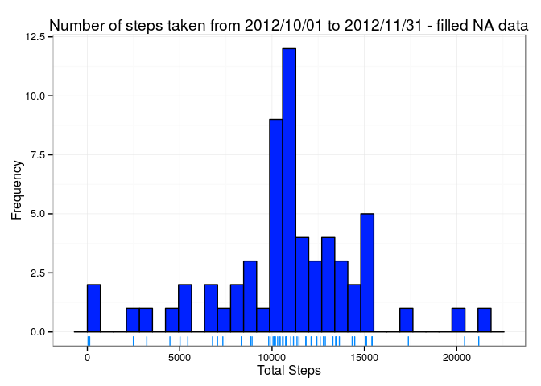

# Reproducible Research: Peer Assessment 1

## Loading and preprocessing the data

At first, we load the packages needed to clean-up the data, namely `lubridate` and `dplyr`. Then, we read the raw data and store it in `raw_data`. We reformat the data on the correct format, more specifically column `date` in `POSIXct` class, and column `interval` in `POSIXct` class, assuming UNIX time (origin = `1970-01-01`).


```r
library(dplyr)
library(lubridate)

path_to_data <- file.path('data', 'activity.csv')
raw_data <- tbl_df(read.csv(path_to_data))
analytic_data <- raw_data %>%
    mutate(date = ymd(as.character(date))) %>%
    mutate(interval = ((interval %/% 100) * 60 + interval %% 100) * 60) %>%
    mutate(interval = as.POSIXct(interval, origin = '1970-01-01', tz = 'UTC'))
```

The following is a preview of the pre-processed data.


```r
head(analytic_data)
```

```
## Source: local data frame [6 x 3]
## 
##   steps       date            interval
##   (int)     (time)              (time)
## 1    NA 2012-10-01 1970-01-01 00:00:00
## 2    NA 2012-10-01 1970-01-01 00:05:00
## 3    NA 2012-10-01 1970-01-01 00:10:00
## 4    NA 2012-10-01 1970-01-01 00:15:00
## 5    NA 2012-10-01 1970-01-01 00:20:00
## 6    NA 2012-10-01 1970-01-01 00:25:00
```

## What is mean total number of steps taken per day?

Firstly, we are going to calculate daily total steps, and store it in `daily_total_steps` for further use.


```r
daily_total_steps <- analytic_data %>%
    group_by(date) %>%
    summarise(total_steps = sum(steps, na.rm = TRUE))

head(daily_total_steps)
```

```
## Source: local data frame [6 x 2]
## 
##         date total_steps
##       (time)       (int)
## 1 2012-10-01           0
## 2 2012-10-02         126
## 3 2012-10-03       11352
## 4 2012-10-04       12116
## 5 2012-10-05       13294
## 6 2012-10-06       15420
```

Next, we are going to take a look on the distribution of the data - some of the data are missing, so it would be of interest to take a look on the skewed distribution and how we are going to fix it. We are going to use `ggplot2` for plotting - the variable `g` will accumulate all plotting information needed.


```r
library(ggplot2)

colPalette <- rainbow(45)

g1 <- ggplot(daily_total_steps, aes(total_steps)) 
g1 <- g1 + geom_histogram(col = 'black', fill = colPalette[30]) # colors with blue
g1 <- g1 + labs(x = 'Total Steps', y = 'Frequency')
g1 <- g1 + labs(title = 'Number of steps taken from 2012/10/01 to 2012/11/31')
g1 <- g1 + geom_rug(col = colPalette[27])
g1 <- g1 + theme_bw(base_size = 12, base_family = 'sans')

print(g1)
```

 

As we can see, the missing values highly skew the total number of steps taken daily - 10 days with near-to-zero steps are recorded. We are going to discuss what we are going to do with the missing value later - for now, let's see the effect of such outliers with summary statistics of the data; more specifically, median and mean.


```r
daily_total_steps_summary <- summary(daily_total_steps$total_steps)
median_total_steps <- daily_total_steps_summary['Median']
mean_total_steps <- daily_total_steps_summary['Mean']

print(daily_total_steps_summary[3:4])
```

```
## Median   Mean 
##  10400   9354
```

We recorded median of 10400 and mean of 9354.

## What is the average daily activity pattern?

Firstly, we are going to calculate the daily average. Using the similar approach with `group_by` function, we get a new summary, named `average_activity_data`. 


```r
average_activity_data <- analytic_data %>%
    group_by(interval) %>%
    summarise(avg_steps = mean(steps, na.rm = TRUE)) %>%
    arrange(interval) 

head(average_activity_data)
```

```
## Source: local data frame [6 x 2]
## 
##              interval avg_steps
##                (time)     (dbl)
## 1 1970-01-01 00:00:00 1.7169811
## 2 1970-01-01 00:05:00 0.3396226
## 3 1970-01-01 00:10:00 0.1320755
## 4 1970-01-01 00:15:00 0.1509434
## 5 1970-01-01 00:20:00 0.0754717
## 6 1970-01-01 00:25:00 2.0943396
```

The interval will show date of `1970-01-01` - this is due to formatting as POSIXct. Finally, let's show a plot to further understand this.


```r
library(scales)

g2 <- ggplot(average_activity_data, aes(interval, avg_steps))
g2 <- g2 + geom_line(col = 'blue')
g2 <- g2 + scale_x_datetime(labels = date_format('%H:%M'), 
                          breaks = date_breaks('3 hours'), 
                          expand = c(0,0))
g2 <- g2 + theme_bw(base_size = 12, base_family = 'sans')
g2 <- g2 + labs(x = 'Time of the day', y = 'Average number of steps') 
g2 <- g2 + labs(title = 'Average activity data on a day')

print(g2)
```

 

As we can see, we have a peak some-time around 9 AM - around 200 steps. Let's see the maximum average number of steps, and when does it happen.


```r
result <- average_activity_data %>%
    filter(avg_steps == max(avg_steps))

print(result)
```

```
## Source: local data frame [1 x 2]
## 
##              interval avg_steps
##                (time)     (dbl)
## 1 1970-01-01 08:35:00  206.1698
```

Indeed, we see that at time of 08:35, the maximum number of steps, that is 206.17 steps is recorded.

## Inputing missing values

We see that there are a lot of missing values. Let's find out how many of them are actually missing.


```r
number_of_rows <- nrow(analytic_data)
number_of_NA_steps <- sum(is.na(analytic_data$steps))

number_of_NA_steps
```

```
## [1] 2304
```

We see that there are 2304 data with missing steps, out of 17568 observations. These missing values constitute 13.1% of all observations.

Let's now figure out a way to fill in these data, so we can proceed further with our observation. Let's stick with the most basic strategy: Fill it in with daily average, that we have calculated in section two. Indeed, with the data that we have, this will be easy. The filled data will be located at `filled_data`


```r
# create lookup table for easy look
rownames(average_activity_data) <- format(average_activity_data$interval, "%H:%M")

filled_data <- tbl_df(merge(analytic_data, average_activity_data, by='interval'))

filled_data <- filled_data %>%
    arrange(date, interval) %>%
    mutate(steps = ifelse(is.na(steps), avg_steps, steps)) %>%
    select(-avg_steps)
```

Again, let's re-do the histogram in part 1. We can use practically the same code to report our results.


```r
daily_total_steps_filled <- filled_data %>%
    group_by(date) %>%
    summarise(total_steps = sum(steps, na.rm = TRUE))

colPalette <- rainbow(45)

g3 <- ggplot(daily_total_steps_filled, aes(total_steps)) 
g3 <- g3 + geom_histogram(col = 'black', fill = colPalette[30]) # colors with blue
g3 <- g3 + labs(x = 'Total Steps', y = 'Frequency')
g3 <- g3 + labs(title = 'Number of steps taken from 2012/10/01 to 2012/11/31 - filled NA data')
g3 <- g3 + geom_rug(col = colPalette[27])
g3 <- g3 + theme_bw(base_size = 12, base_family = 'sans')

print(g3)
```

```
## stat_bin: binwidth defaulted to range/30. Use 'binwidth = x' to adjust this.
```

 

We see that the histogram is no longer skewed to the left - we recover a lot of missing data, and subsequently the peak shifts to the center of the plot.

And the summary statistics, `mean` and `median` as well.


```r
daily_total_steps_filled_summary <- summary(daily_total_steps_filled$total_steps)
median_total_steps_filled <- daily_total_steps_filled_summary['Median']
mean_total_steps_filled <- daily_total_steps_filled_summary['Mean']

print(daily_total_steps_filled_summary[3:4])
```

```
## Median   Mean 
##  10770  10770
```

We recorded median of 10770 and mean of 10770. Let's compare the two summary statistics with the original data in the following table.


```r
library(xtable)

combined_table <- rbind(daily_total_steps_summary, daily_total_steps_filled_summary) 
rownames(combined_table) <- c('Daily Total Steps', 'Daily Total Steps (Filled)')
xt <- xtable(data.frame(combined_table[,3:4, drop=FALSE]), digits = 0)
print.xtable(xt, type = 'html')
```

<!-- html table generated in R 3.2.2 by xtable 1.8-0 package -->
<!-- Fri Nov 13 00:16:30 2015 -->
<table border=1>
<tr> <th>  </th> <th> Median </th> <th> Mean </th>  </tr>
  <tr> <td align="right"> Daily Total Steps </td> <td align="right"> 10400 </td> <td align="right"> 9354 </td> </tr>
  <tr> <td align="right"> Daily Total Steps (Filled) </td> <td align="right"> 10770 </td> <td align="right"> 10770 </td> </tr>
   </table>

We see that the median and mean increases, as expected. As more data are filled in, these missing data (which were not counted) are getting counted, thereby shifting both statistics.

## Are there differences in activity patterns between weekdays and weekends?
